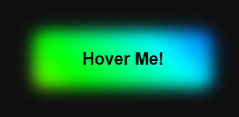

# ✨ CSS Glow Button

A stylish and modern **glowing button** built using **HTML** and **CSS**, featuring smooth hover effects and eye-catching animations.

---

## 🌐 Live Demo

🔗 https://ilakshyasrivastava.github.io/css-glow-button/

---

## 📸 Preview

---

## ⚙️ Tech Stack

- HTML5  
- CSS3  

---

## ✨ Features

- 🌙 Dark theme design  
- ✨ Glowing effect  
- 🎯 Smooth hover animation  
- 🖱️ Interactive button UI  
- ⚡ Lightweight and fast

---

👨‍💻 Author
Lakshya Pratap Srivastava
🔗 https://github.com/ilakshyasrivastava⁠�

---

⭐ Show your support
If you like this project, give it a ⭐ on GitHub!

---

## 📁 Project Structure
